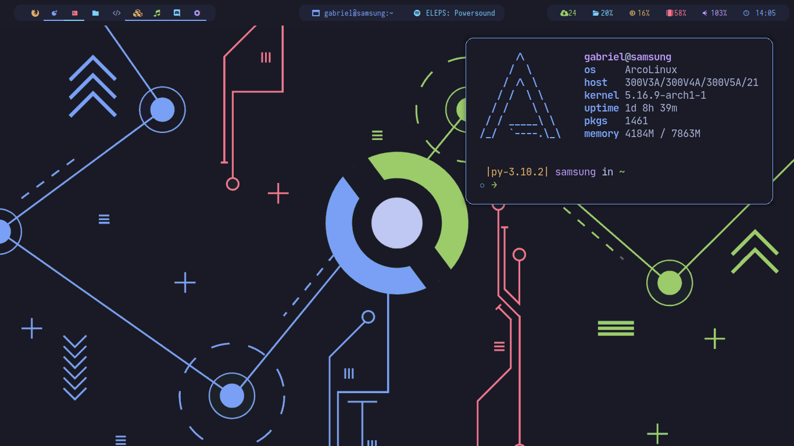
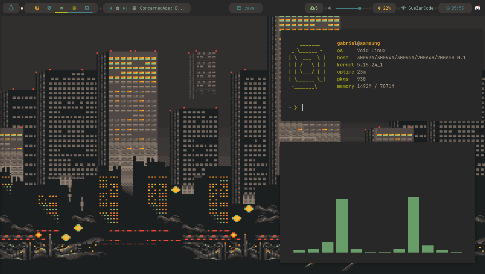
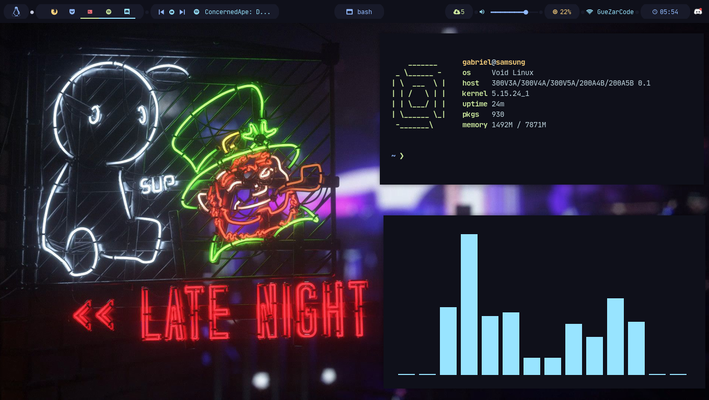

# Bspwm Dotfiles V2

> This is a refactor of my old [bspwm setup](https://github.com/AlphaTechnolog/bspwm-dotfiles)

My Configuration files for my new bspwm setup


## Note

If you like this configuration, you can give me a star pls :)

You really make me happy if you do it :D

## Requirements

I am using Arch Linux, but I expect you have it, to make all work

- Iosevka Nerd Font
- Sauce Code Pro Nerd Font
- Material Icons
- kitty
- alacritty (optional, but alternative to kitty)
- rofi
- sxhkd
- bspwm
- polybar
- picom
- feh
- bat
- exa
- dunst

> This requirements will be installed with the autoinstaller

## Shells

I use `bash` and `zsh` I include the configuration for it and it's frameworks

- bash: oh my bash `~/.bashrc`
  - Subrequirements: pfetch
- zsh: oh my zsh `~/.zshrc`

For zsh I use powerlevel 10k, I include the configuration in `~/.p10k.zsh` and
the configuration for zsh `~/.zshrc`

## Installation

- The installers only works in an arch-based system because dependencies are installed with pacman and yay
- The installers only install bash (oh my bash) configuration, but configurations for oh my zsh and zsh and powerlevel10k are included.
- The installers may copy your old configurations files to `filename.old` if it found it's folders, it don't delete your old configuration folders

### Autoinstall script

I create an autoinstaller that download the files, copy it on your system folders
and install the dependencies

To use it, execute this command:

```sh
curl https://raw.githubusercontent.com/AlphaTechnolog/bspwm-dotfiles-v2/main/install.sh | bash
```

## Dotbot

You can install with dotbot too with three simple bash-script commands

```sh
git clone https://github.com/AlphaTechnolog/bspwm-dotfiles-v2 ~/.bspwm-dotfiles
cd ~/.bspwm-dotfiles
bash install-dotbot.sh
```

And that's all

## Wallpapers

I have a lot of wallpapers, it are published in [.sample-wallpapers](https://github.com/AlphaTechnolog/bspwm-dotfiles-v2/tree/main/.sample-wallpapers) folder

> You can get more catppuccin-based wallpapers [here](https://github.com/catppuccin/wallpapers)

## Galery






> A tool to change themes is in development :D

## Dedicated to

[my brother](https://github.com/Jags1906) <3

## Thanks to

- [Catppuccin community](https://github.com/catppuccin) (To help me with a lot of inspiration and feedback, in the discord server)
- Akali (To help me with a lot of solutions and feedback <3)
- Dlltsuki (To help me a lot with feedback and the dotbot installation <3)
- Bleyom (To help me with some inspiration and feedback <3) (He has a very beautiful rices, in his [profile](https://github.com/Bleyom))
- KOK41 (To help me with some ideas and concepts <3)
