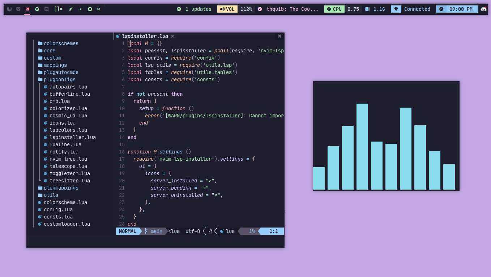
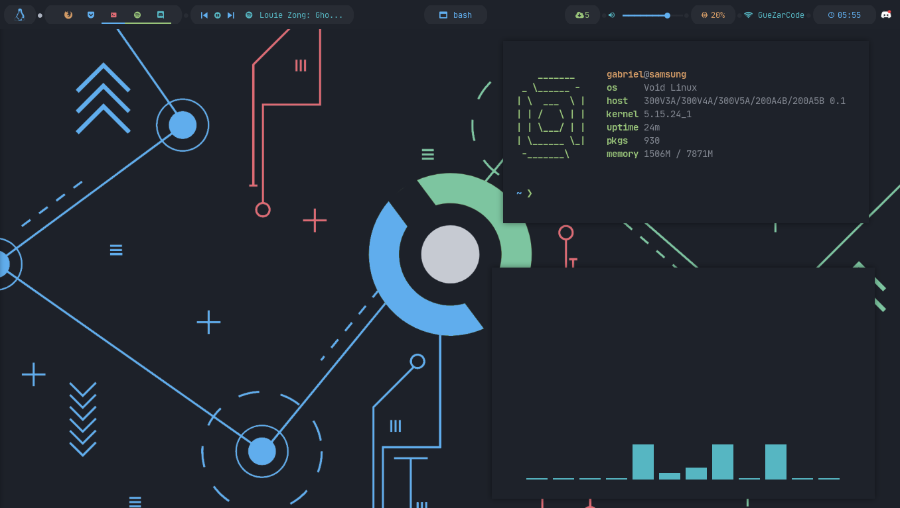
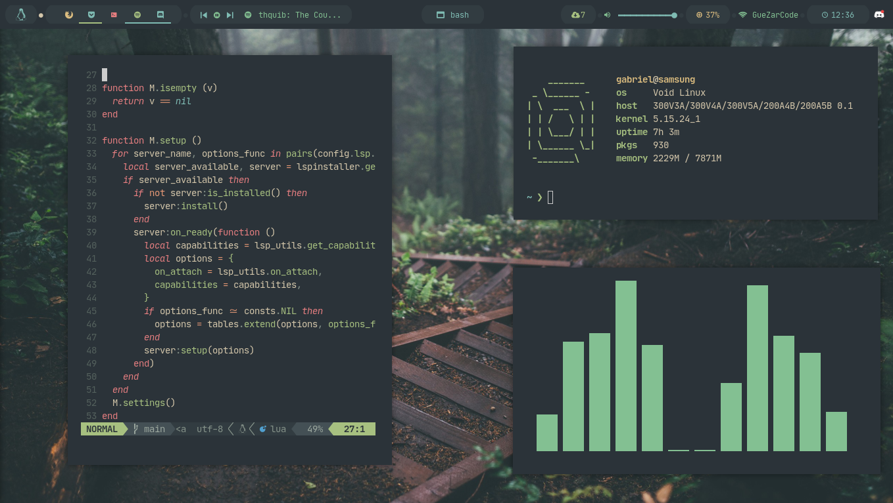
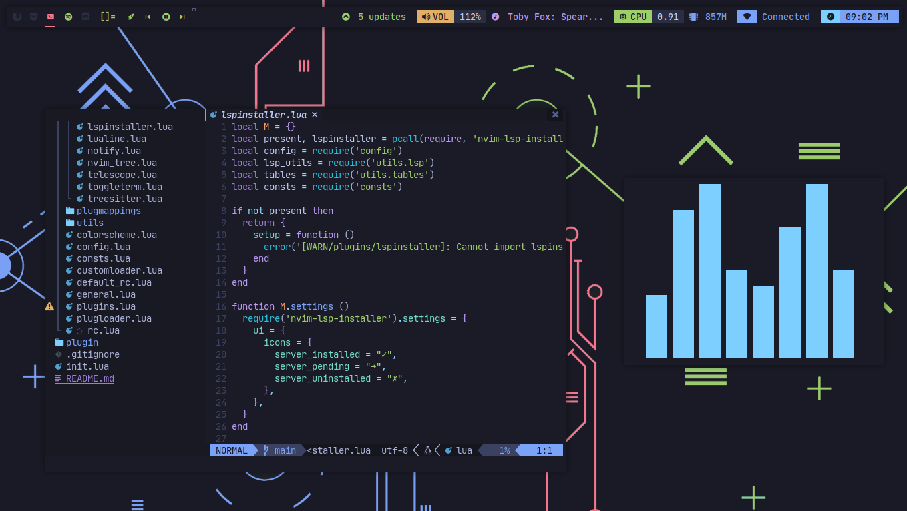
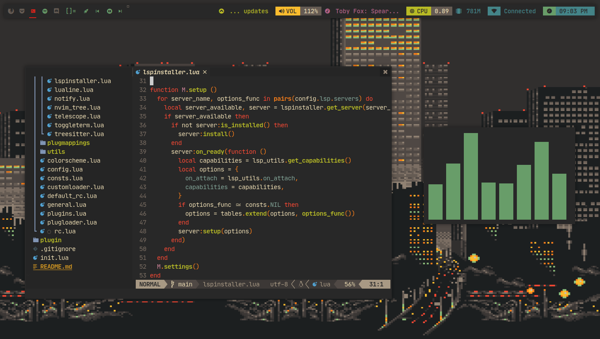
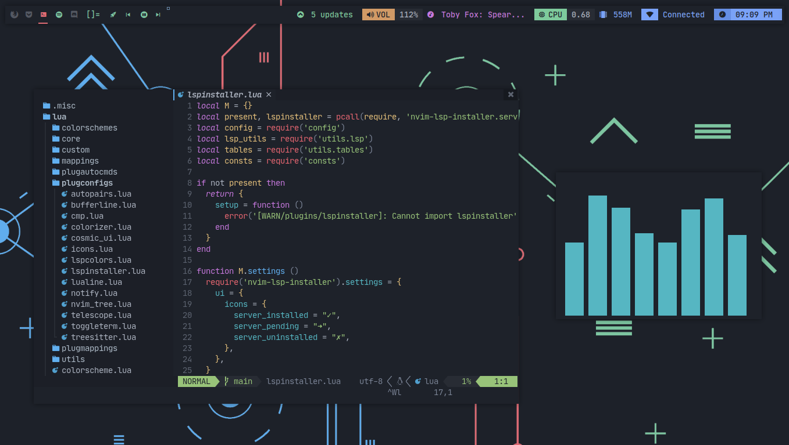

# Dotfiles

My Configuration files for my new bspwm/dwm setup




## Note

If you like this configuration, you can give me a star pls :)

You really make me happy if you do it :D

## Requirements

I am using void linux, I expect you use it to make all work, but installation
also works for Arch Linux

- Iosevka Nerd Font
- Sauce Code Pro Nerd Font
- Material Icons
- alacritty
- kitty (optional, but alternative to alacritty)
- rofi
- sxhkd
- bspwm
- polybar
- picom
- feh
- bat
- exa
- dunst
- starship
- pfetch

> This requirements will be installed with the autoinstaller

## Shells

I use `bash`, `zsh` and `fish`. I use this shells, but in combination with starship.

- bash: bash + starship `~/.bashrc`
- zsh: zsh + starship `~/.zshrc`
- fish: fish + starship `~/.config/fish/config.fish`

## Installation

- The installers only works for void linux and arch linux
- The installers setup bash as default shell, but configuration with starship are created too for `fish` and `zsh`
- The installers may copy your old configurations files to `filename.old` if it found it's folders, it don't delete your old configuration folders

### Autoinstall script

I create an autoinstaller that download the files, copy it on your system folders
and install the dependencies

To use it, execute this command:

```sh
curl https://raw.githubusercontent.com/AlphaTechnolog/dotfiles/main/install.sh | bash
```

Or at clone the dotfiles (is important that the dotfiles are in ~/.dotfiles):

```sh
git clone https://github.com/AlphaTechnolog/dotfiles.git ~/.dotfiles
cd ~/.dotfiles
./install.sh
```

## Dotbot

You can install with dotbot too with three simple bash-script commands

```sh
git clone https://github.com/AlphaTechnolog/dotfiles ~/.dotfiles
cd ~/.dotfiles
bash install-dotbot.sh
```

And that's all

## Tips

### Change theme

I made a tool `.local/bin/themer` that change the theme automatically,
to use it, use the keyboard shortcut: `super + t`, that open a rofi window
where you can select the theme.

If you use [nvcodark](https://github.com/AlphaTechnolog/nvcodark), it
can change automatically the theme of it, modifying the `~/.config/nvim/lua/rc.lua`
file trying to apply the selected theme, to enable it support, open the file `~/.local/bin/themer`
and then change `NVCODARK_SUPPORT=0` to `NVCODARK_SUPPORT=1`, then change
the theme normally with `super + t`.

I create ports for my setup using precreated palettes, now only exists support for:

- catppuccin
- tokyonight
- gruvbox
- material-ocean
- onedark
- everforest

> Go to the [galery](#galery) to see screenshots of the styles

## Keybindings

- super + Return: `kitty` (open kitty)
- super + shift + Return: `rofi -show drun` (open rofi)
- super + Escape: `pkill -USR1 -x sxhkd` (restart sxhkd)
- super + shift + q: `bspc quit` (quit bspwm)
- super + shift + r: `bspc wm -r` (reload bspwm)
- super + Tab: `bspc desktop -l next` (next layout (monocle or tiled))
- super + shift + Tab: `bspc desktop -l previous` (prev layout (monocle or tiled))
- super + y: `bspc node newest.marked.local -n newest.!automatic.local` (send the newest marked node to the newest preselected node)
- super + g: `bspc node -s biggest` (swap the current node and the biggest node)
- super + t: `bspc node -t tiled` (set window state to tiled)
- super + space: `bspc node -t floating` (set window state to floating)
- super + f: `bspc node -t fullscreen` (set window state to fullscreen)
- super + ctrl + m: `bspc node -g marked` (set node flag to marked)
- super + ctrl + x: `bspc node -g locked` (set node flag to locked)
- super + ctrl + y: `bspc node -g sticky` (set node flag to sticky)
- super + ctrl + z: `bspc node -g private` (set node flag to private)
- super + b: `firefox` (spawn firefox)
- super + shift + t: `~/.local/bin/themer` (spawn themer)

## Wallpapers

I have a lot of wallpapers, it are published in [.sample-wallpapers](https://github.com/AlphaTechnolog/dotfiles/tree/main/.sample-wallpapers) folder

> You can get more catppuccin-based wallpapers [here](https://github.com/catppuccin/wallpapers)

## Galery

I have two setups: bspwm and chadwm, continue scrolling to see awesome screenshots of all styles!

### Bspwm

This is the first setup that I made with this styles! it works for bspwm with polybar and much love

#### Catppuccin


#### Tokyonight


#### Gruvbox


#### Material Ocean


#### Onedark


#### Everforest


### Dwm with chadwm

This config also includes a custom setup based on [chadwm](https://github.com/siduck/chadwm), it's really beautiful too, I love it.
Some screenshots here (it has the same themes of the bspwm setup):

#### Catppuccin


#### Tokyonight



#### Gruvbox



#### Material Ocean


#### Onedark



#### Everforest


## Dedicated to

[my brother](https://github.com/Jags1906) <3

## Thanks to

- [Catppuccin community](https://github.com/catppuccin) (To help me with a lot of inspiration and feedback, in the discord server)
- Akali (To help me with a lot of solutions and feedback <3)
- Dlltsuki (To help me a lot with feedback and the dotbot installation <3)
- Bleyom (To help me with some inspiration and feedback <3) (He has a very beautiful rices, in his [profile](https://github.com/Bleyom))
- KOK41 (To help me with some ideas and concepts <3)
